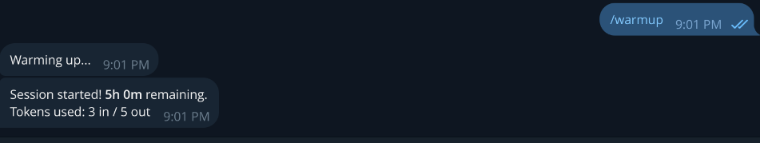
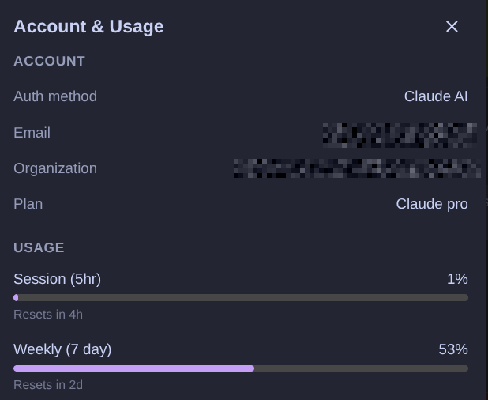

# Claude Code Session Bot

Telegram bot to warm up Claude Code sessions and track session timing.

## Why?

Claude Code Pro's 5-hour session cooldown means hours of dead time between sessions. If you exhaust your session at 3pm, you can't use Claude Code again until 8pm. That's half a workday gone.

This bot starts sessions while you sleep. Schedule `/schedule tomorrow 9am` and the bot warms up at 6am — by 9am you still have 2 hours of usage left, enough for a productive morning. By 11am the session expires, the cooldown starts, and by the afternoon you have a fresh session ready to go.

## Commands

| Command                        | Description                                                                      |
| ------------------------------ | -------------------------------------------------------------------------------- |
| `/warmup`                      | Start a session now via `claude -p`                                              |
| `/session`                     | Show active session info (time remaining, tokens, expiry)                        |
| `/schedule <datetime> [hours]` | Schedule a warmup. At `<datetime>`, you'll have `[hours]` remaining (default: 2) |
| `/schedules`                   | List pending scheduled warmups                                                   |
| `/cancel <id>`                 | Cancel a scheduled warmup                                                        |
| `/history`                     | Show recent session history                                                      |

<details>
<summary>Click to show screenshots</summary>





</details>

### Schedule examples

```
/schedule tomorrow 9am        # 2h remaining at 9am → warmup at 6am
/schedule monday 14:00 3      # 3h remaining at 14:00 → warmup at 12:00
/schedule jan 30 8:00 4h      # 4h remaining at 8:00 → warmup at 7:00
```

The bot computes: `warmup_time = target - (5h - hours_remaining)`.

## How it works

1. **Warmup**: Runs `claude -p "ready" --output-format json` which sends a minimal prompt to Claude, starting the 5-hour session timer. The JSON response includes `session_id` and token usage.
2. **Session tracking**: Each warmup is recorded in a local SQLite database with start time, expiry (start + 5h), and token usage.
3. **Scheduling**: Schedules are persisted in SQLite and restored on bot restart using `setTimeout`.
4. **Auth**: Only Telegram user IDs listed in `TELEGRAM_ALLOWED_USER_IDS` can use the bot.

### Limitations

Session tracking is **self-managed** — the bot records when it starts a session and computes time remaining locally. There is no Anthropic API to query session status, and we intentionally avoid reverse-engineering internal endpoints to prevent account bans.

This means:

- Sessions started outside the bot (e.g. from your dev machine) are **not tracked**. The bot only knows about sessions it started itself.
- If you start a session manually and then ask the bot, it may show "no active session" or stale data.
- The bot is designed to be the **sole session starter** — use it from a dedicated VPS for best results.

## Setup

### Prerequisites

- **Claude Code CLI** must be installed and authenticated on the host machine (or inside the Docker container).

### Installation

```bash
# edit .env with your values
cp .env.example .env
pnpm install
pnpm build
pnpm start
```

### Environment variables

| Variable                    | Description                                         |
| --------------------------- | --------------------------------------------------- |
| `TELEGRAM_BOT_TOKEN`        | Bot token from [@BotFather](https://t.me/BotFather)    |
| `TELEGRAM_ALLOWED_USER_IDS` | Comma-separated Telegram user IDs                      |
| `TIMEZONE`                  | Display timezone (default: `UTC`)                      |
| `DB_PATH`                   | SQLite database path (default: `data/bot.db`)          |
| `CLAUDE_CODE_OAUTH_TOKEN`   | OAuth token for Claude CLI auth (used in Docker)       |

## Docker

```bash
docker compose up -d --build
```

Set `CLAUDE_CODE_OAUTH_TOKEN` in your `.env` file for Claude CLI auth inside the container.
